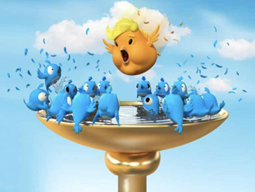
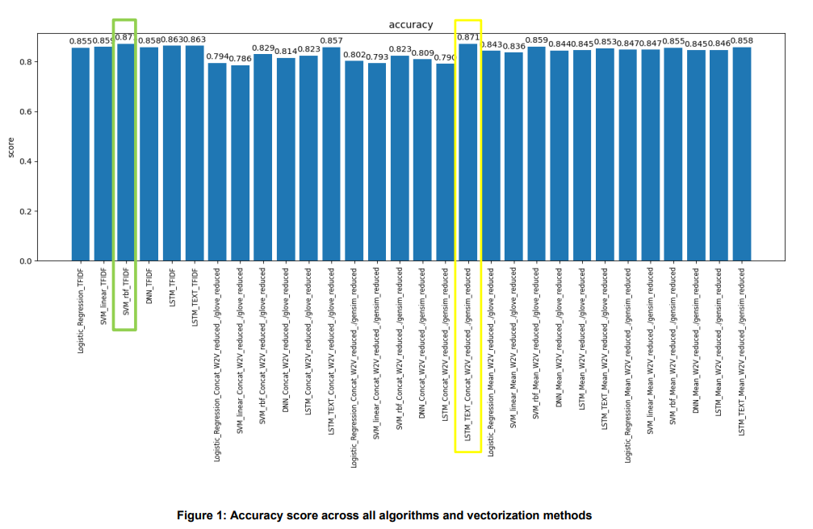

#  Authorship Attribution - LSTM networks

In this task, we used various algorithms for text classification, to perform an authorship attribution on Donald Trump’s tweets. 

---
## Classification: Who Controls this Account
Politicians, as well as other public figures, usually have assistants and staffers that manage most of their social media presence. However, like many other norm defying actions, Donald Trump, the 45th President of the United States is taking pride in his untamed use of Twitter.  At times, during the presidential campaign, it was hypothesized that Donald Trump is being kept away from his Twitter account in order to avoid unnecessary PR calamities. Trump’s tweets are not explicitly labeled (Hillary Clinton, for example, used to sign tweets composed by her by an addition of ‘-H’ at the end of the tweet while unsigned tweets were posted by her staffers). It is known, however, that Trump was using an android phone  while the staffers were most likely to use an iPhone. Luckily, the device information is part of the data available via the Twitter API, hence the device used can be used as an authorship label. 

In this task we used a number of supervised machine learning classifiers in order to validate the hypothesis about Trump tweeting habits.

